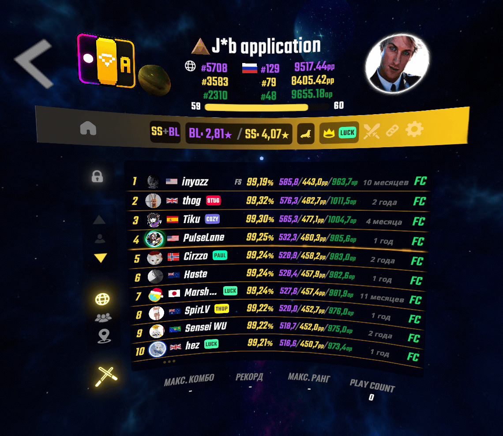

# Multileaderboard/ScoreLeader PC mod

An open-source leaderboard for Beat Saber
Now you can have BeatLeader, ScoreSaber and AccSaber Reloaded combined in one UI!
You'll still need to have ScoreSaber mod to upload your scores

## Usage

- Download zip for your game version from the [Releases](https://github.com/avalage/MultiLeaderBoard/releases) and extract it to your BeatSaber directory
- Make sure to install and update all required [dependencies](#dependencies)

If you have any suggestions or bug reports - you can leave them in my DMs discord: avalage

## Dependencies

- BSIPA, BSML, SiraUtil - available in [ModAssistant](https://github.com/Assistant/ModAssistant/releases/latest) and on the [BeatMods website](https://beatmods.com/#/mods)
- [LeaderboardCore](https://github.com/rithik-b/LeaderboardCore)